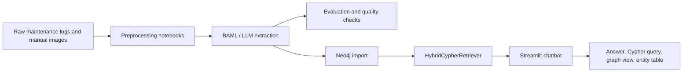

# GraphRAG Industrial Fault Analysis

GraphRAG Industrial Fault Analysis is a thesis project for industrial fault diagnosis on IBM3 and IBM4 ion beam machine maintenance data. It combines large language model extraction, a Neo4j knowledge graph, hybrid graph retrieval, and a Streamlit chatbot so technicians can ask troubleshooting questions and inspect the graph context behind an answer.

The repository contains source code, notebooks, BAML schemas, Docker support for local model work, and curated non-sensitive evaluation figures. Raw datasets, processed datasets, extracted JSON outputs, credentials, model checkpoints, and local experiment outputs are intentionally excluded from git.

## What This Project Does

The pipeline has five main stages:

1. Preprocess IBM3 and IBM4 maintenance logs into grouped fault cases.
2. Extract structured entities from logs and manual-book troubleshooting images.
3. Evaluate extraction quality against annotated cases.
4. Load validated fault entities into Neo4j as a knowledge graph.
5. Serve a Streamlit GraphRAG chatbot that retrieves graph context and generates multilingual technician-facing answers.



## Repository Layout

```text
.
|-- .env.example
|-- .github/
|   `-- copilot-instructions.md
|-- docker/
|   `-- llama/
|       `-- Dockerfile
|-- docs/
|   |-- DATA_AND_ARTIFACTS.md
|   |-- PROJECT_DOCUMENTATION.md
|   `-- SECURITY.md
|-- experiments/
|   `-- evaluation_results/
|       |-- error_breakdown_missing_vs_hallucination.png
|       |-- field_wise_f1_grouped_bar_bootstrap_ci.png
|       `-- field_wise_f1_heatmap.png
|-- notebooks/
|   |-- chatbot_experimentation/
|   |-- data_preprocessing/
|   `-- knowledge_extraction/
|-- src/
|   |-- d3_graph.html
|   |-- streamlit_app.py
|   |-- models/
|   |   `-- baml/
|   |       |-- baml_src/
|   |       `-- baml_client/
|   `-- utils/
|       |-- chatbot_service.py
|       `-- retriever.py
|-- requirements.txt
`-- README.md
```

Local-only directories that are expected but not committed:

```text
data/
datasets/
experiments/<generated runs>
trained_models/
checkpoints/
outputs/
logs/
```

## Setup

### 1. Clone the repository

```bash
git clone https://github.com/Wan-Razaq/GraphRAG-Industrial-Fault-Analysis.git
cd GraphRAG-Industrial-Fault-Analysis
```

### 2. Create and activate a virtual environment

Windows PowerShell:

```powershell
python -m venv .venv
.\.venv\Scripts\Activate.ps1
pip install -r requirements.txt
```

macOS/Linux:

```bash
python -m venv .venv
source .venv/bin/activate
pip install -r requirements.txt
```

### 3. Configure local secrets

Copy the example file and fill in local values:

```bash
cp .env.example .env
```

On Windows PowerShell:

```powershell
Copy-Item .env.example .env
```

Required variables:

```text
OPENAI_API_KEY=
NEO4J_URI=
NEO4J_USER=
NEO4J_PASS=
```

Optional variables used by selected notebooks or BAML clients:

```text
NEO4J_BROWSER_URL=
ANTHROPIC_API_KEY=
OPENROUTER_API_KEY=
DEKA_API_KEY=
GROQ_API_KEY=
```

Never commit `.env`, provider keys, database passwords, raw data, processed data, or generated extraction outputs.

## Run The Streamlit Chatbot

From the repository root:

```bash
streamlit run src/streamlit_app.py
```

The chatbot:

- Detects whether the user is asking in English or Dutch.
- Retrieves relevant Neo4j graph context with `HybridCypherRetriever`.
- Streams an OpenAI answer through `src/utils/chatbot_service.py`.
- Labels graph-grounded content as `[Graph]` and general model knowledge as `[LLM]`.
- Shows graph context, Cypher query, and extracted entities below assistant responses.

## Knowledge Graph Model

The graph centers on four node labels:

```text
FaultLocation
FaultSymptom
FaultReason
FaultMeasure
```

The main relationships are:

```text
(FaultLocation)-[:HAS_FAULT]->(FaultSymptom)
(FaultSymptom)-[:CAUSED_BY]->(FaultReason)
(FaultSymptom)-[:MITIGATED_BY]->(FaultMeasure)
```

`FaultLocation` may include machine context for IBM3 or IBM4. `MITIGATED_BY` relationships can carry resolution status where available.

## Main Workflows

Preprocessing:

- `notebooks/data_preprocessing/group_logs_IBM3_IBM4.ipynb`
- Groups IBM3 and IBM4 logs by case ID.
- Produces local JSONL files for annotation and extraction.

Knowledge extraction:

- `src/models/baml/baml_src/maintenance.baml`
- Defines `FaultReport`, `FaultLocation`, `FaultReason`, `FaultMeasure`, and extraction functions.
- Supports log-text extraction and troubleshooting-table image extraction.
- Generated Python BAML client code lives under `src/models/baml/baml_client/`.

Evaluation:

- `notebooks/knowledge_extraction/evaluation.ipynb`
- Computes exact, partial, missing, and hallucinated entity matches.
- Produces field-wise F1 charts and missing-vs-hallucination summaries.

Neo4j import:

- `notebooks/knowledge_extraction/import-to-Neo4j.ipynb`
- Loads extracted fault reports into the graph schema.
- Creates/uses graph indexes expected by the retriever.

Chatbot:

- `src/streamlit_app.py`
- `src/utils/retriever.py`
- `src/utils/chatbot_service.py`
- `src/d3_graph.html`

## Documentation

More detailed documentation is available in:

- [Project documentation](docs/PROJECT_DOCUMENTATION.md)
- [Data and artifact policy](docs/DATA_AND_ARTIFACTS.md)
- [Security guide](docs/SECURITY.md)

## Git And Data Safety

This repository is configured to ignore sensitive and generated files, including:

- `.env` and secret files.
- Raw and processed datasets under `data/` and `datasets/`.
- JSON, JSONL, CSV, Excel, PDF, database, and pickle artifacts.
- Generated experiment runs and logs.
- Model checkpoints and binary model files.
- Local scratch and ad-hoc experiment notebooks.

Before pushing:

```bash
git status --short --ignored
git diff --cached --stat
git diff --cached --name-only
```

Only commit reviewed source, documentation, schemas, and intentionally curated non-sensitive figures. Do not commit notebooks with sensitive outputs unless they have been cleared and reviewed.
