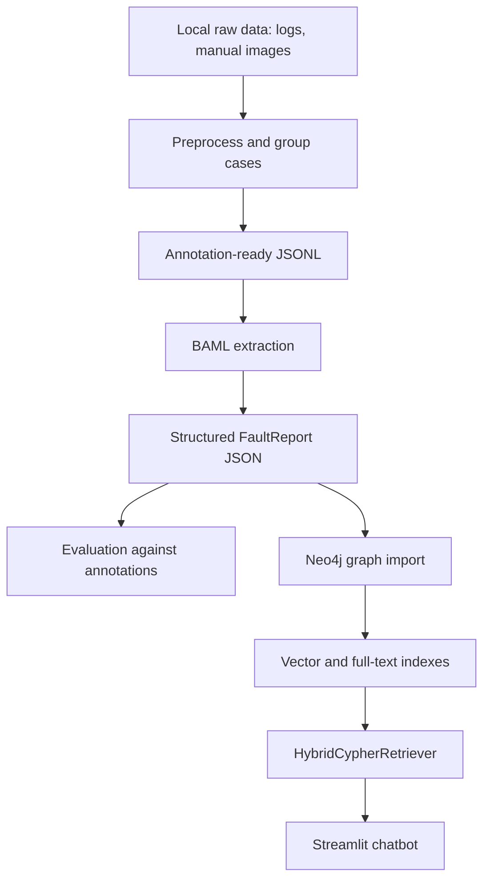

# Project Documentation

## Purpose

GraphRAG Industrial Fault Analysis supports fault diagnosis for IBM3 and IBM4 ion beam machine maintenance scenarios. The project turns historical maintenance logs and manual-book troubleshooting material into a structured Neo4j knowledge graph, then uses graph retrieval and an LLM chatbot to help technicians answer troubleshooting questions.

The core idea is GraphRAG: retrieve structured fault context from a graph first, then generate an answer that explains the relevant fault location, symptoms, possible causes, and corrective measures.

## System Overview



The public repository contains reusable code, schemas, notebooks, and documentation. The data used to run the pipeline lives locally and is intentionally excluded from git.

## Components

### Streamlit Application

File: `src/streamlit_app.py`

Responsibilities:

- Provides the chat user interface.
- Maintains conversation state in `st.session_state`.
- Calls the retriever to fetch graph context for the latest question.
- Builds lightweight graph data for visualization.
- Streams the generated answer into the UI.
- Shows three context views for graph-grounded answers:
  - Graph visualization
  - Cypher query
  - Extracted entities table

### Retriever

File: `src/utils/retriever.py`

Responsibilities:

- Loads environment variables from `.env`.
- Opens the Neo4j driver.
- Configures `OpenAIEmbeddings`.
- Creates a `HybridCypherRetriever`.
- Defines the Cypher traversal used to expand retrieved nodes into fault context.

Required Neo4j indexes:

```text
content_index
fulltext-index
```

The retriever expects graph nodes to use the labels and properties described in the graph schema below.

### Chatbot Service

File: `src/utils/chatbot_service.py`

Responsibilities:

- Loads the OpenAI API key from the environment.
- Detects whether user input is Dutch or English.
- Builds a system prompt for industrial maintenance troubleshooting.
- Injects graph context before the newest user message.
- Streams answer tokens from OpenAI.

The current answer model is configured as:

```text
gpt-4o
```

### D3 Graph View

File: `src/d3_graph.html`

Responsibilities:

- Receives graph JSON from Streamlit.
- Renders nodes and relationships with D3.js.
- Uses color to distinguish locations, symptoms, reasons, and measures.
- Supports zoom and drag interactions.

### BAML Schema And Client

Primary schema files:

```text
src/models/baml/baml_src/maintenance.baml
src/models/baml/baml_src/clients.baml
src/models/baml/baml_src/generators.baml
```

Generated Python client files:

```text
src/models/baml/baml_client/
```

The BAML schema defines:

- `Machine`
- `FaultLocation`
- `FaultReason`
- `FaultMeasure`
- `ResolutionStatus`
- `FaultReport`
- `ExtractFaultInfo`
- `ExtractFaultsFromImage`

`ExtractFaultInfo` extracts structured fault reports from maintenance log text. `ExtractFaultsFromImage` extracts structured fault reports from troubleshooting-table images.

## Graph Schema

### Node Labels

`FaultLocation`

- Represents the machine component or subsystem where a fault occurs.
- Important properties:
  - `name`
  - `machine`, when known, for IBM3 or IBM4

`FaultSymptom`

- Represents observable behavior or problem descriptions.
- Important properties:
  - `description`

`FaultReason`

- Represents stated or inferred causes.
- Important properties:
  - `name`

`FaultMeasure`

- Represents corrective actions, checks, replacements, or mitigations.
- Important properties:
  - `description`

### Relationships

```cypher
(FaultLocation)-[:HAS_FAULT]->(FaultSymptom)
(FaultSymptom)-[:CAUSED_BY]->(FaultReason)
(FaultSymptom)-[:MITIGATED_BY]->(FaultMeasure)
```

`MITIGATED_BY` can include resolution metadata when the source extraction provides it.

## Data Pipeline

### 1. Preprocessing

Notebook:

```text
notebooks/data_preprocessing/group_logs_IBM3_IBM4.ipynb
```

Purpose:

- Load preprocessed IBM3 and IBM4 maintenance records from local files.
- Combine both machines into one working dataset.
- Group rows by case ID.
- Build text blocks with source, issue text, and resolution status.
- Export local JSONL files for annotation, few-shot examples, and extraction.

Outputs are local-only and ignored by git.

### 2. Annotation Reformatting

Notebook:

```text
notebooks/knowledge_extraction/Extracted_data_reformatting.ipynb
```

Purpose:

- Convert Doccano-style annotations into a normalized JSON structure.
- Map labels into `FaultLocation`, `FaultSymptom`, `FaultReason`, and `FaultMeasure`.
- Prepare ground truth for evaluation.

Outputs are local-only and ignored by git.

### 3. Knowledge Extraction

Notebooks:

```text
notebooks/knowledge_extraction/few-shot-gpt4.ipynb
notebooks/knowledge_extraction/few-shot-gpt4.1.ipynb
notebooks/knowledge_extraction/few-shot-gpt-oss-20B.ipynb
notebooks/knowledge_extraction/few-shot-llama33.ipynb
notebooks/knowledge_extraction/few-shot-qwen3-30B.ipynb
notebooks/knowledge_extraction/BAML-Schema Conformance Evaluation.ipynb
```

Purpose:

- Run BAML extraction against local JSONL cases.
- Compare provider/model behavior.
- Save local JSON extraction outputs.
- Support schema conformance checks.

The notebooks can contain execution outputs and excerpts from local data. Do not commit new or modified notebooks unless outputs have been cleared and contents have been reviewed.

### 4. Evaluation

Notebook:

```text
notebooks/knowledge_extraction/evaluation.ipynb
```

Purpose:

- Compare model extraction results with formatted annotations.
- Track exact matches, partial matches, missing entities, and potential hallucinations.
- Compute precision, recall, F1, and bootstrap confidence intervals.
- Generate summary charts.

Curated chart images currently included in the repo:

```text
experiments/evaluation_results/error_breakdown_missing_vs_hallucination.png
experiments/evaluation_results/field_wise_f1_grouped_bar_bootstrap_ci.png
experiments/evaluation_results/field_wise_f1_heatmap.png
```

Generated JSON detail files remain local-only.

### 5. Neo4j Import

Notebook:

```text
notebooks/knowledge_extraction/import-to-Neo4j.ipynb
```

Purpose:

- Read local structured extraction output.
- Merge locations, symptoms, reasons, and measures into Neo4j.
- Create graph relationships.
- Update or validate graph properties.

The import notebook reads Neo4j credentials from `.env`. It should not contain hardcoded credentials.

### 6. Chatbot Runtime

Command:

```bash
streamlit run src/streamlit_app.py
```

Runtime flow:

1. User asks a question.
2. Language detection selects English or Dutch response behavior.
3. Retriever searches Neo4j using hybrid vector/full-text retrieval.
4. Traversal query expands from matching nodes to connected graph context.
5. Graph context is formatted for the LLM.
6. The answer is streamed back to the user.
7. Graph, Cypher, and entity table views are attached to the assistant response when graph context is used.

## Configuration

Required environment variables:

```text
OPENAI_API_KEY
NEO4J_URI
NEO4J_USER
NEO4J_PASS
```

Optional environment variables:

```text
NEO4J_BROWSER_URL
ANTHROPIC_API_KEY
OPENROUTER_API_KEY
DEKA_API_KEY
GROQ_API_KEY
```

Use `.env.example` as the template. The real `.env` file must stay local.

## Development Workflow

Recommended local workflow:

1. Create or activate `.venv`.
2. Install `requirements.txt`.
3. Create `.env` from `.env.example`.
4. Keep raw data under `data/`.
5. Run preprocessing or extraction notebooks locally.
6. Inspect generated JSON outputs locally.
7. Import reviewed extraction results into Neo4j.
8. Start Streamlit and test the chatbot.
9. Before committing, inspect `git status --short --ignored`.
10. Commit only reviewed code, docs, schemas, and curated non-sensitive assets.

## Verification

Suggested checks after code changes:

```bash
python -m compileall src
streamlit run src/streamlit_app.py
```

Suggested checks before a push:

```bash
git status --short --ignored
git diff --cached --name-only
git diff --cached --stat
```

For notebooks:

```bash
jupyter nbconvert --clear-output --inplace path/to/notebook.ipynb
```

Only run the notebook-cleaning command on notebooks you intentionally want to commit.

## Known Limitations

- The current app creates the Neo4j driver at import time. Missing credentials will stop the app early with a clear error.
- The retrieval query depends on expected Neo4j labels, properties, and index names.
- Several notebooks are research artifacts and may contain saved execution outputs.
- Some model/provider clients in BAML are optional and require separate keys.
- The public repository does not include data, so full reproduction requires local access to the raw and processed thesis datasets.

## Maintenance Notes

- Do not commit raw or processed datasets.
- Do not commit generated extraction JSON files.
- Do not commit `.env` or service credentials.
- Do not commit local model checkpoints.
- Treat notebook outputs as potentially sensitive until cleared.
- Rotate provider keys immediately if any key is accidentally exposed.
